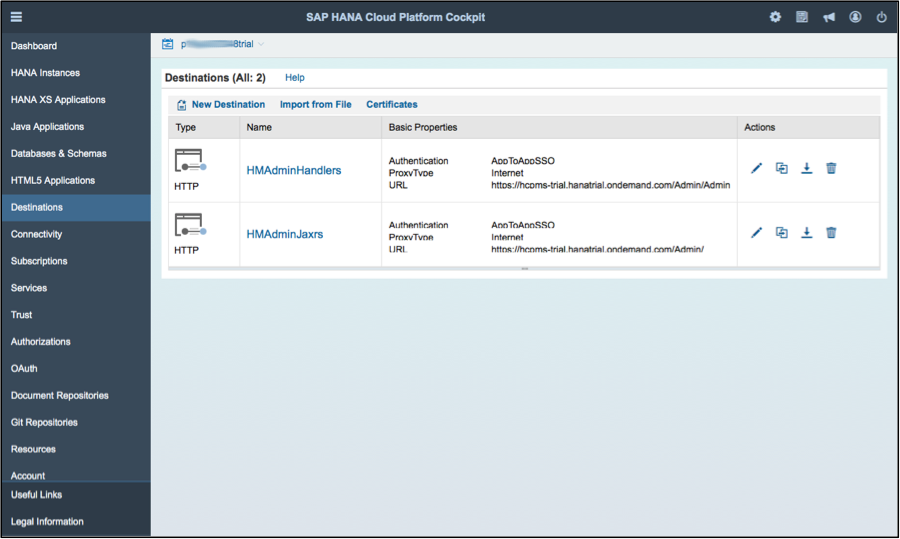
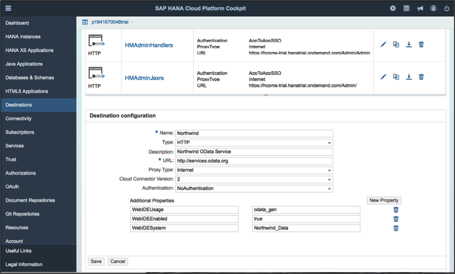

## 1 Details update

### Overview
Destinations are used for the outbound communication of your application to a remote system (which can be a cloud or on-premise system). You will create a destination by giving it a name, URL of the remote system or service, the authentication type, and some other configuration data.

The data source you will use in this tutorial series is called "Northwind", which is a publically accessable OData source hosted by www.odata.org:

The data source URL is <http://services.odata.org/V2/Northwind/Northwind.svc/>

**Time to complete: <5 min**

### Procedure

1. Go to <https://account.hanatrial.ondemand.com> and log in to your HCP cockpit.

 ![mob1-1_1.png] (mob1-1_1.png)

2. Select the **Destinations** tab on the left side, and then click on **New Destination…** to open a new destination configuration form.

 

3. Enter/confirm all fields in the Destination configuration section with the information below.

 Field Name     | Value
 :------------- | :-------------
 Name           | `Northwind`
 Type           | `HTTP`
 Description    | `Northwind OData Service`
 URL            | `http://services.odata.org`
 Proxy Type     | `Internet`
 Authentication | `NoAuthentication`
 
 Add three **Additional Properties** fields by clicking on the **New Property** button once for each property.
 
 Field Name     | Value
 :------------- | :-------------
 `WebIDEEnabled`  | `true`
 `WebIDESystem`   | `Northwind_Data`
 `WebIDEUsage`    | `odata_gen`

 
 
4. Click **Save**.

## Next Step:
